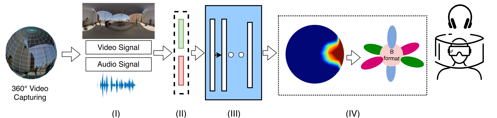

In this repository, we are sharing our developed 360-degree Audio-Visual Dataset (360AVD) that we hope will foster further research in multimedia signal processing area. This repository contains materials for the paper: *Towards generating ambisonics using audio-visual cue for virtual reality*

### Abstract

Ambisonics *i.e.,* a full-sphere surround sound, is quintessential with 360-degree visual content to provide a realistic virtual reality (VR) experience. While 360-degree visual content capture gained a tremendous boost recently, the estimation of corresponding spatial sound is still challenging due to the required sound-field microphones or information about the sound-source locations. In this paper, we introduce a novel problem of generating Ambisonics in 360-degree videos using the audiovisual cue. With this aim, firstly, a novel 360-degree audio-visual video dataset of 265 videos is introduced with annotated sound-source locations. Secondly, a pipeline is designed for an automatic Ambisonic estimation problem. Benefiting from the deep learning based audiovisual feature-embedding and prediction modules, our pipeline estimates the 3D sound-source locations and further use such locations to encode to the B-format. To benchmark our dataset and pipeline, we additionally propose evaluation criteria to investigate the performance using different 360-degree input representations. Our results demonstrate the efficacy of the proposed pipeline and open up a new area of research in 360-degree audio-visual analysis for future investigations.

### Pipeline


### Downloads

[Dataset][http://v-sense.scss.tcd.ie/Datasets/audiovisualVR.zip]

A sample of Ambisonics estimation using the proposed pipeline can be find with the following link:
[v10_c3_3][https://github.com/V-Sense/360AudioVisual/blob/master/demo/v10_spa.mp4]

### Citation
| Paper accepted in [International Conference on Acoustics, Speech, and Signal Processing 2019 (ICASSP)](https://ieeexplore.ieee.org/xpl/conhome/8671773/proceeding) |

Please cite our [paper](https://v-sense.scss.tcd.ie/wp-content/uploads/2019/02/ICASSP2019_multimodal.pdf) in your publications if it helps your research:
````
@inproceedings{multimodal2019,
author={A. {Rana} and C. {Ozcinar} and A. {Smolic}}, 
booktitle={ICASSP 2019 - 2019 IEEE International Conference on Acoustics, Speech and Signal Processing (ICASSP)}, 
title={Towards Generating Ambisonics Using Audio-visual Cue for Virtual Reality}, 
year={2019}, 
doi={10.1109/ICASSP.2019.8683318}, 
ISSN={2379-190X}, 
month={May}
}
````
### Authors

| [Aakanksha Rana][Aakanksha-web] | [Cagri Ozcinar][CagriOzcinar-web] | [Aljosa Smolic][AljosaSmolic-web] |

[Aakanksha-web]: (https://v-sense.scss.tcd.ie/?profile=template_profile)

[CagriOzcinar-web]: (https://www.scss.tcd.ie/~ozcinarc/)

[AljosaSmolic-web]: (https://v-sense.scss.tcd.ie/?profile=prof-aljosa-smolic-2)

### Acknowledgement

This publication has emanated from research conducted with the financial support of Science Foundation Ireland (SFI) under the Grant Number *15/RP/2776*. We gratefully acknowledge the support of NVIDIA Corporation for the donation of GPUs used in this work.

### Contact

If you have any question, send an e-mail at [ozcinarc@scss.tcd.ie]() or [ranaa@scss.tcd.ie]()
